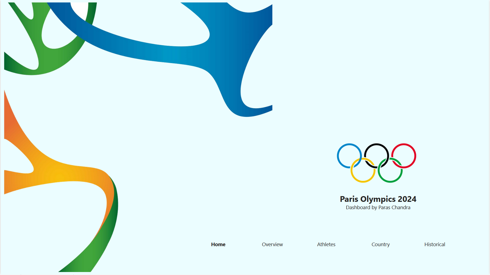
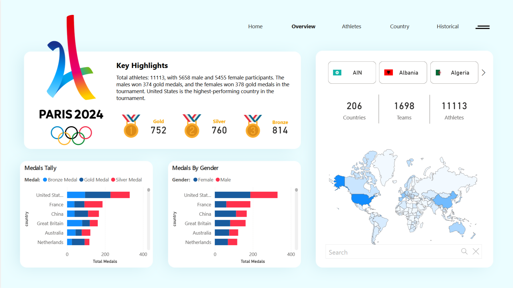
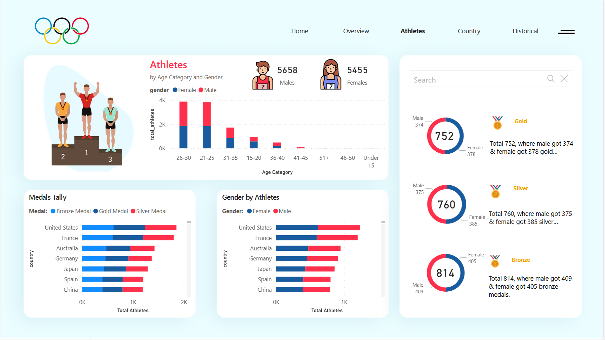
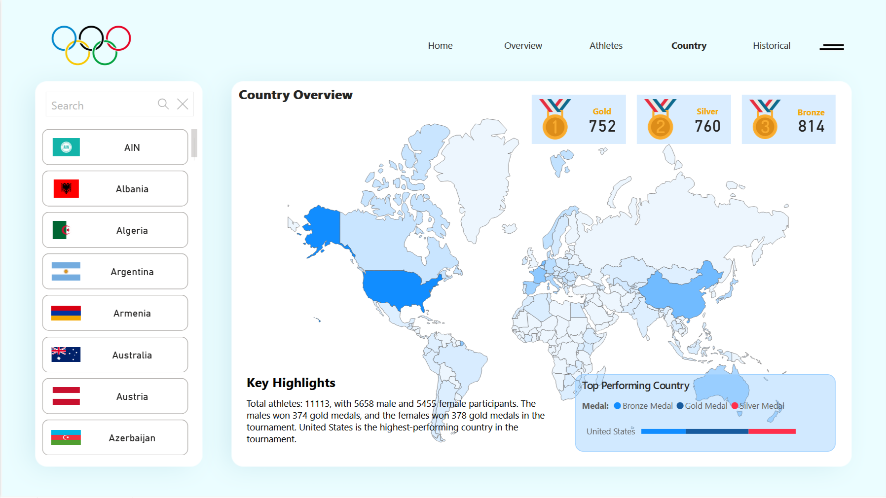
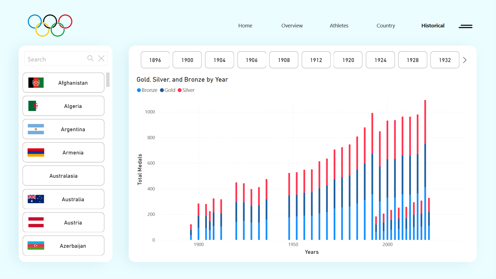

# Olympics 2024 Data Analysis & Historical Insights using Power BI

The goal of this project is to design and develop a Power BI dashboard to analyze the performance, trends, and patterns of the Olympics 2024 and historical data.

## Problem statement

The dashboard should provide actionable insights for the following key objectives:

1. **Historical Performance Analysis**

    - Analyze the medal tallies of countries from past Olympic events.
    - Identify trends in country-wise performance over the years.
    - Highlight top-performing athletes and sports across multiple Olympic events.

2. **Olympics 2024 Monitoring**

    - Track real-time updates for Olympics 2024 events, including medal tallies and athlete performances.
    - Visualize data by country, sport, and athlete to gain granular insights.

3. **Demographic and Participation Insights**

    - Analyze the participation trends by gender, age, and region.
    - Evaluate the growth of new sports and their impact on medal distribution.

4. **Geographical Representation**

    - Create interactive maps to showcase regional participation and medal dominance.

## Steps Followed in this project

1. Used Python to retrieve the Paris olympics data from Kaggle.
2. Load the data into PowerBi using Python script.
3. Data Cleaning in power query.
4. Performed ETL process (Extract Transform and Load).
5. Created measure for needs and used them for creating visuals in PowerBi.
6. Performed merge on dataset to join assets on country.
7. Data Validation
8. Data Modelling and Visualization.

## Final result 

### Overview Page

-------
 
 
 ### Athletes Insights

-------
 
 

 ### Country Insights
 
 -----------
 
  
 
 ### Historical Insights
 
 -----------
 
  